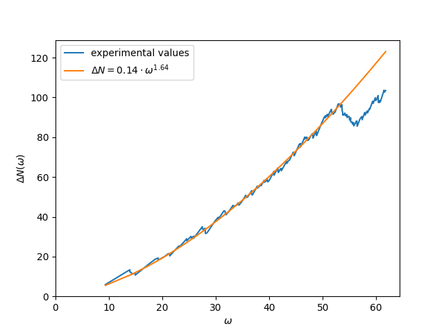

# Fractal drum

## Grid constant

l = 0 => grid const = L

l = 1 => grid const = L/4
l = n => grid const = L/(4^n)

## Checking if a square is inside or outside

Note: the walls are already marked as walls
Note2: When talking about n: n is a number proportional to 1/lattice constant.

Method 1 (bfs/dfs - breadth-first search/depth-first search):
    Begin at a point that we know is inside the fractal: the middle. Do a bfs/dfs where we do not cross the walls, and mark all found grid points as inside. All other points are outside. This assumes of course that the middle point is inside the fractal.

Method 2 (lt_slow - line trick slow):
    From a given point. Traverse a single direction until the end of the grid. Let the number of intersections with the fractal be N. If N is odd we are inside the drum, if N is even or zero we are outside. Note: needs double resolution (half grid constant) in order to add space between all walls in order to count them properly. This is O(n^3), but is O(n) if only looking at a single point (lazy).

Method 3 (lt - line trick):
    Iterate over entire grid. Count number of walls crossed for any given line. When number of walls crossed is odd we are inside, else we are outside. Only O(n^2). Still requires double resolution, is not lazy. I think it requires less memory than dfs or bfs since we dont need queue.


Timing:
```
Level 3
bfs single resolution | 1000000 loops: 39.8294176 µs
bfs double resolution | 1000 loops: 275.8226000000001 µs
dfs single resolution | 1000000 loops: 48.8377178 µs
dfs double resolution | 100 loops: 335.32000000000005 µs
lt double resolution | 1000000 loops: 121.31520490000001 µs
lt_slow double resolution | 100 loops: 4.201659 ms

Level 4
bfs single resolution | 1000 loops: 666.2706000000001 µs
bfs double resolution | 100 loops: 2.8250930000000003 ms
dfs single resolution | 100 loops: 832.682 µs
dfs double resolution | 100 loops: 3.46452 ms
lt double resolution | 100 loops: 1.524936 ms
lt_slow double resolution | 1 loops: 190.1811 ms

Level 5
bfs single resolution | 10 loops: 12.33178 ms
bfs double resolution | 10 loops: 49.52395 ms
dfs single resolution | 10 loops: 14.40914 ms
dfs double resolution | 10 loops: 53.323010000000004 ms
lt double resolution | 10 loops: 24.074039999999997 ms
lt_slow double resolution | 1 loops: 12.3228916 s

Level 6
bfs single resolution | 1 loops: 210.1188 ms
bfs double resolution | 1 loops: 909.714 ms
dfs single resolution | 1 loops: 210.53109999999998 ms
dfs double resolution | 1 loops: 855.6668000000001 ms
lt double resolution | 1 loops: 407.8406999999999 ms
lt_slow double resolution | dnf, too slow
```

From timing i learned that my implementation of bfs is usually slifhtly faster than my implementation of dfs for some reason. I have no idea why. I also learned that for double resolution the line trick solution is always faster. I will be using this going forward since i think that it is the cleanest solution, and fits best with the problem description. The "line trick slow" solution is unsuprisingly much slower. This i believe to be for two reasons. Firstly it uses bounds checks due to the way the iteration is done. Secondly it has to iterate over many more grid points, being O(n^3). The pattern could be useful since it is possible to check if a single point is inside or outside the grid (would be O(n)), but is very slow for checking all points.

## Solving the wave equation

Found using level 4

| Eigenvalues | w/v   |
| ----------- | ----- |
| 88.86       | 9.42  |
| 200.00      | 14.14 |
| 207.76      | 14.41 |
| 209.93      | 14.49 |
| 226.87      | 15.06 |
| 310.89      | 17.63 |
| 356.64      | 18.88 |
| 377.01      | 19.42 |
| 398.39      | 19.96 |
| 421.55      | 20.53 |
| 452.72      | 21.28 |
| 465.27      | 21.57 |
| 540.17      | 23.24 |


## Task 5

Solving at level 2 takes 0.05 s.
Solving at level 3 takes 0.42 s.
Solving at level 4 takes 120 s, and uses 143 MB memory.
I don't think solving at level 5 is practical for such an iterative process, but it takes XXX s and uses 1.7 GB memory which is about a tenth of my RAM
Solving at level 6 would not be practical. 

Note: coming back here from the future to note that when extracting more eigenvalues (before 10, now 400) the memory usage increases significantly. 

### What problems do we have with increasing level

In order to solve at a higher level we would need to reduce the ram usage and the cpu time. 

### How do we fix these problems

Since we can't be expected to improve upon the fortran code used in the solving algorithm, i suppose this must be done by shrinking the matrix. 

One way to shrink the matrix can be to remove all pairwise rows and cols that contain only zeros, which will be most of the rows and cols. I did implement this :^). For level 5 this reduces the shape of my matrix from about (3e6)^2 to about (1e6)^2. It now only uses 1 GB memory, which is suprisingly not that much less. It was also finally realistically possible to solve for this level, which took 21 minutes.

The solution speed of level 4 was reduced from 120 seconds to only 4. The shape of the matrix is here reduced from 182329^2 to 5734^2. Do note that both the original and the shrunk matrices are sparse, and are thus stored in some way where size does not nessecarily correlate with their shape. By checking the actual size of the matrix before and after shrinking, i confirmed that the size of the matrix' internal data (before being sent into the solver) was not changed. It is however very possible that this had an effect on some intermediary state of the data inside the eigenvalue algorithm.

This does however not make it "practical" to solve for levels 8 or 10, as it merely shifted the runtimes by one level. The time it used to take for level 4 it now takes for level 5.

Maybe there exists a way to solve this by only considering pairs of points on the boundary, or line segments between points on the boundary. If this is the case the amount of points in the matrix would be severely reduced.

After these performance improvements i did task 4 again and achieved these results:

Level = 4, and with 2 points between each corner.

| Eigenvalue | w/v   |
| ---------- | ----- |
| 88.44      | 9.40  |
| 198.44     | 14.09 |
| 198.44     | 14.09 |
| 206.11     | 14.36 |
| 208.39     | 14.44 |
| 226.23     | 15.04 |
| 226.23     | 15.04 |
| 309.83     | 17.60 |
| 355.22     | 18.85 |
| 375.99     | 19.39 |
| 375.99     | 19.39 |
| 398.37     | 19.96 |
| 421.81     | 20.54 |
| 453.41     | 21.29 |
| 465.42     | 21.57 |
| 465.42     | 21.57 |
| 540.97     | 23.26 |
| 553.14     | 23.52 |
| 615.13     | 24.80 |
| 615.13     | 24.80 |
| 657.28     | 25.64 |
| 660.14     | 25.69 |
| 682.04     | 26.12 |

## Task 6 - finding the d

Preamble: number of mids. Number of mids are the amount of points between each corner of the fractal. They are always equally spaced. This is illustrated in the following figure.


The d seems to be at about 1.6. It varies with level l, number of grid points between corners and with number of eigvals considered.

Learnings:
    2 mids seems to be sufficient. For 200 slns at level 3, the difference between 2 and 3 mids is miniscule. Note: for 4 mids, the value is completely different for some reason.

| Level | N_mids | d     |
| ----- | ------ | ----- |
| 2     | 2      | 1.48  |
| 2     | 3      | 1.511 |
| 3     | 0      | 1.304 |
| 3     | 1      | 1.335 |
| 3     | 2      | 1.605 |
| 3     | 3      | 1.604 |
| 3     | 4      | 1.334 |
| 4     | 1      | 1.516 |

There is no clear convergence in these values. When slicing and only using the 120 first eigenvalues per solution, the results are different.

| Level | N_mids | d     |
| ----- | ------ | ----- |
| 2     | 2      | 1.268 |
| 2     | 3      | 1.310 |
| 3     | 0      | 1.588 |
| 3     | 1      | 1.633 |
| 3     | 2      | 1.639 |
| 3     | 3      | 1.641 |
| 3     | 4      | 1.642 |
| 4     | 1      | 1.659 |

We now see a better convergence. The reason i chose to do this is that there is a kink in the data at about that number of eigenvalues, depending on level l and number of mid points. Because a different portion of the kink is included in the different data sets, its effect on the results was also varying. By cutting off the eigenvalues before this kink, we eliminated this moment.




Do note however that this curve does not follow the experimental values for very large number of eigenvalues.

§[Level 3 with 1 mids, 1000 sols](../py/images/finding_d_l3_1mids_n%3D1000.png)

This might however be due to problems in the data set, because for the very large number of eigenvalues we can se that the values do not follow the proposed shape at all. In fact they go towards Delta N = 0, which does not make sense according to the model explained in the task.

The d-values are increasing slightly per increase in calculation size, but the amount of increase is very small so i think it is safe to say that for l = inf we could assume the d to be less than if not equal to 2.

## Task 7 - higher order solutions

Level 3, 2 mids

| Eigenvalue | w/v   |
| ---------- | ----- |
| 87.73      | 9.37  |
| 196.02     | 14.00 |
| 203.51     | 14.27 |
| 205.86     | 14.35 |
| 224.38     | 14.98 |
| 307.07     | 17.52 |
| 351.73     | 18.75 |
| 372.19     | 19.29 |
| 394.49     | 19.86 |
| 417.99     | 20.44 |

Level 4, 2 mids

| Eigenvalue | w/v   |
| ---------- | ----- |
| 88.58      | 9.41  |
| 198.91     | 14.10 |
| 206.62     | 14.37 |
| 208.88     | 14.45 |
| 226.59     | 15.05 |
| 310.37     | 17.62 |
| 355.91     | 18.87 |
| 376.74     | 19.41 |
| 399.11     | 19.98 |
| 422.55     | 20.56 |

## Task 8 - Clamped

TODO

what does it mean?