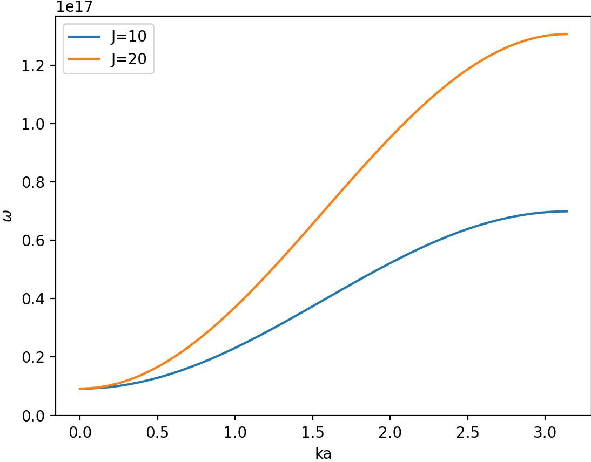

# Exercise 2

## Task 2.1

I managed to set up the toy system. It behaves as seen below

### Single spin

With a single spin, the magnet precesses counter-clockwise about the z-axis.

With nonzero dampening constant the precessing slows down and the single magnet tends toward the z-axis. Higher dampening constant gives more slowing down and more tendance towards the z-axis. Values: d$_z$ = 1 meV (1e-3)

, 

When i set the temperature to a non-zero value, the dampening is less intense. The system still tends toward the z-axis, but this is also less intense. Both of these effects are now more intense when the precession speed or distance from z-axis is great and less when the values are small.
the dampening is cancelled, but the system still tends toward the z-axis. This is until it finds an equilibrium distance away from the z-axis where it stays still. 

Note: T=0.1 means 0.1 d$_z$ or 0.1 meV (1e-4)

, 

### Exploring coupling with N = 10

I expect the ground state to be all magnets aligned. In my case most magnets are aligned.

## Task 2.2

### Estimate frequency range

$$
ℏω = 2d_z + 2J(1 − cos(ka))
$$

$ℏ \approx 6.6e-16 eV s$, $d_z = 3meV$, $J = 10meV$ og cosinus er alltid mellom 1 og -1. Dermed blir ω i størrelsesorden $1e16 s^{-1}$.

### Sketch omega(ka)

From sketching omega we can see that we get a increasing function, with a smaller slope at the beginning and the end. We can also see that for J = 2J we get almost twice as big a result at ka=pi as when J = J. At ka=0 they are the same, 2dz (intersection with the y-axis). 

The dz sets the ground level, and the J determines the slope and thus the top.

### Do DFT and plot

I learned that by reducing the dampening constant, i get a more defined line. A lot of the plot is zero, so i have to crop the image. Right is lower alpha=0.01, right is alpha=0.2. Ignore legend.

### Fitting omega sketch to picture

Since the axis on the resulting image don't really make sense, I don't get the point of explaining how scaling was done, but here we go anyways. I cropped out a ton of the dft image. Then i set the extents to be [0, pi] for ka and [0, 1e15] for ω. I additionally scaled the ω function by 0.7. For dz = 1meV and J = 10meV i aquire this image (will do dz = 3 later):

