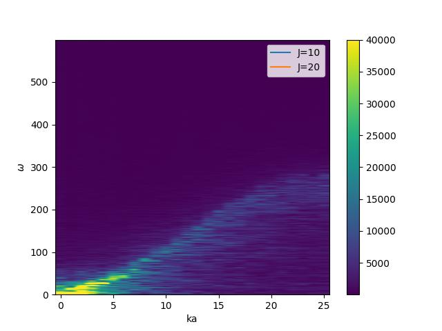
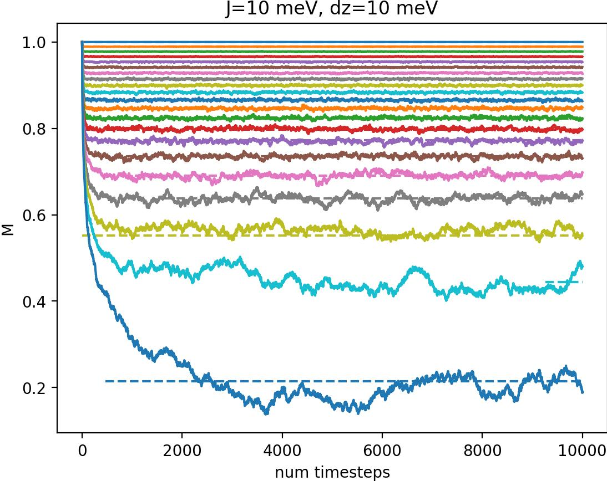
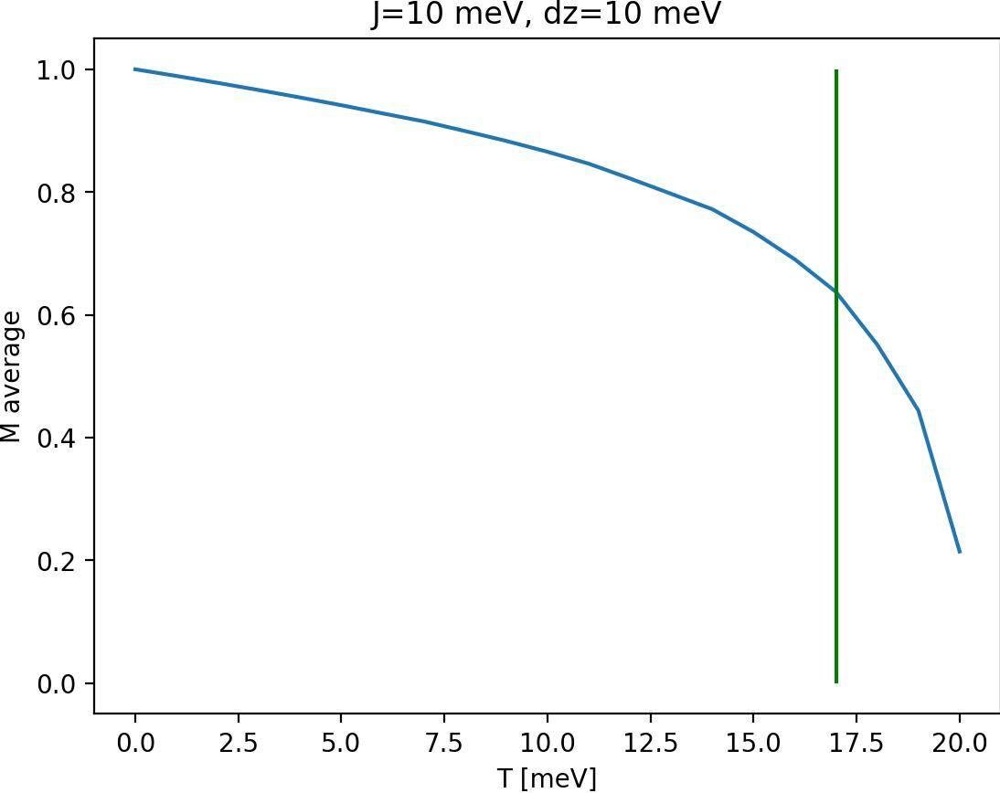

# Exercise 2

## Task 2.1

I managed to set up the toy system. It behaves as seen below

### Single spin

With a single spin, the magnet precesses counter-clockwise about the z-axis.

With nonzero dampening constant the precessing slows down and the single magnet tends toward the z-axis. Higher dampening constant gives more slowing down and more tendance towards the z-axis. Values: d$_z$ = 1 meV (1e-3)

, 

When i set the temperature to a non-zero value, the dampening is less intense. The system still tends toward the z-axis, but this is also less intense. Both of these effects are now more intense when the precession speed or distance from z-axis is great and less when the values are small.
the dampening is cancelled, but the system still tends toward the z-axis. This is until it finds an equilibrium distance away from the z-axis where it stays still. 

Note: T=0.1 means 0.1 d$_z$ or 0.1 meV (1e-4)

, 

### Exploring coupling with N = 10

I expect the ground state to be all magnets aligned. In my case most magnets are aligned.

## Task 2.2

### Estimate frequency range

$$
ℏω = 2d_z + 2J(1 − cos(ka))
$$

$ℏ \approx 6.6e-16 eV s$, $d_z = 3meV$, $J = 10meV$ og cosinus er alltid mellom 1 og -1. Dermed blir ω i størrelsesorden $1e16 s^{-1}$.

### Sketch omega(ka)

From sketching omega we can see that we get a increasing function, with a smaller slope at the beginning and the end. We can also see that for J = 2J we get almost twice as big a result at ka=pi as when J = J. At ka=0 they are the same, 2dz (intersection with the y-axis). 

The dz sets the ground level, and the J determines the slope and thus the top.

### Do DFT and plot

I learned that by reducing the dampening constant, i get a more defined line. A lot of the plot is zero, so i have to crop the image. Right is lower alpha=0.01, right is alpha=0.2. Ignore legend.

### Fitting omega sketch to picture

Since the axis on the resulting image don't really make sense, I don't get the point of explaining how scaling was done, but here we go anyways. I cropped out a ton of the dft image. Then i set the extents to be [0, pi] for ka and [0, 1e15] for ω. I additionally scaled the ω function by 0.7. For dz = 1meV and J = 10meV i aquire this image (will do dz = 3meV later):

### Other params J and dz

The plots from now on include the entire brillouin zone.

When changing dz from 1meV to 3meV we see that as we expect, the entire line is shifted slightly upwards. We can also see that it is shifted slightly more than we expected, as the theoretical red line is a little below the line in the image.

By doubling J to 20meV we get a twice as tall slope, and the analytic expression fits well with the simulated results. This seems to fit better with theory than the previous case, but that might be two wrongs making a right, as the line does not fit as well at k≈0.

For J = -10meV and dz = 6meV, the theoretical dispersion relation gives ω < 0 at a large part of the 1st brillouin zone. The simulated data does not look anything like the theory. What does it mean???

I also tried J = -10mev, but with dz = 25meV such that the theoretical line never crosses y=0.

### Added magnetic field B

We can see that with an increasing magnetic field, the line gets wider and more diffuse, and rises on the w-axis. The following figures are of B = 0.1, 0.11 and 0.14 meV.

### Antiferromagnet

When i set the system to be antiferromagnetic with J = -03 meV and dz=0.01 we get a spotty dispersion relation.

## Task 3 - Ferromagnetic phase diagrams

From a simulation of a slightly smaller system we can see that the spins align quickly.

We can also see this from the full size system, although it is a little less clear.

We can see that the M falls off slightly for the nonzero T then converges at some value. In this plot J=10 meV, dz=10 meV and $k_BT=0.1$ means $k_BT = 0.1 \cdot J = 1 meV$. Note that for T=0.0 in this figure the system is initialized randomly.

We see that with increasing T the M is lower. Although the method

We can also see the critical temperature of 1.7 J.

