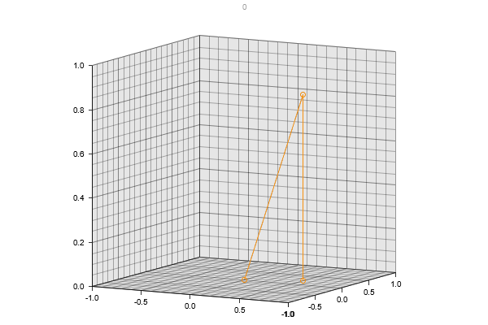

# Exercise 2

## Task 2.1

I managed to set up the toy system. It behaves as seen below

## Single spin

With a single spin, the magnet precesses counter-clockwise about the z-axis.

With nonzero dampening constant the precessing slows down and the single magnet tends toward the z-axis. Higher dampening constant gives more slowing down and more tendance towards the z-axis. Values: d$_z$ = 1 meV (1e-3)

, 

When i set the temperature to a non-zero value, the dampening is less intense. The system still tends toward the z-axis, but this is also less intense. Both of these effects are now more intense when the precession speed or distance from z-axis is great and less when the values are small.
the dampening is cancelled, but the system still tends toward the z-axis. This is until it finds an equilibrium distance away from the z-axis where it stays still. 

Note: T=0.1 means 0.1 d$_z$ or 0.1 meV (1e-4)

, 

## Exploring coupling with N = 10

I expect the ground state to be all magnets aligned. In my case most magnets are aligned.
