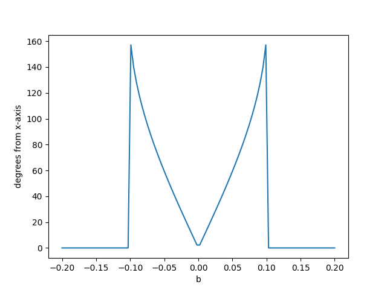
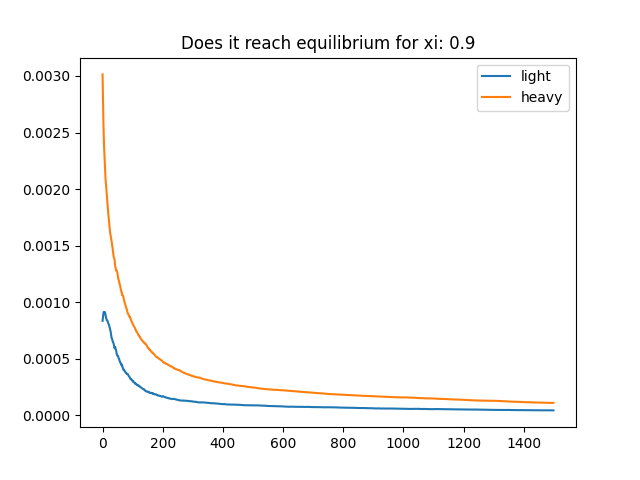
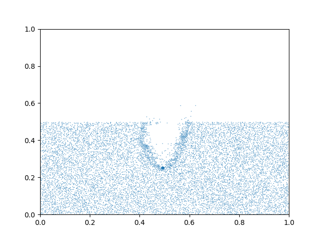
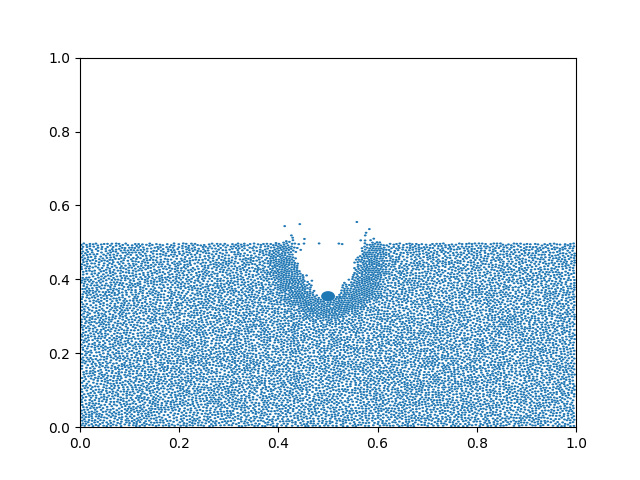

# Report

## Tests

All tests pass. I had some issues with getting increasing total energy but this was due to not incrementing collision count of both particles in particle-particle collision, so it was easy to fix once uncovered.

For test 4 i got this distribution, which looks very reasonable. Note that the reason for the 180° flip is that the particles go from colliding with the large particle to colliding with the wall.

## Problem 1

Running took ~90 seconds for 500_000 collisions of 5_000 particles. To collect more data i did 10_000 more steps 10 times and collected the speeds per step. That makes a total of 55_000 sampled speeds. This might not be independent enough data...

Running with 5_000_000 collisions and 5_000 particles took ~1420 seconds or about 24 minutes. To collect more data i did 500_000 more steps 10 times and collected the speeds per step.

## Problem 2

Took 1745 seconds or about 30 minutes with 5_000_000 collisions and 5_000 particles. Did same data collection as P1. 
Average speed of light particles: 0.056
Average speed of heavy particles: 0.028

## Problem 3

With 5000 particles and 1500 samples * 625 steps per sample it took about 3 minutes per xi. For xi=1 we got this graph:

For xi=0.9 we got this graph:

We can see that for 1 the energy stabilises while for 0.9 the energy falls.

### TC model

For xi = 0.8 i am getting errors telling me that the timestep is negative 🙄.  
I ran this code while printing the time difference between the collisions and saw that 1e-12 seemed like a natural border, as only the collisions right before collapse were this small. This made my code run with no errors. However when running the demo (fewer particles + animation) for problem 4 i can see that the particles are clipping which is not ideal. 

I do however think that this is fine since we don't run task 4 for that long, and I don't encounter this clipping issue in my other simulations. With no tc model its just terrible

Note that the movement here is a result of the way the animation works, there is in reality no movement of time, as we have an infinite amount of collisions per time. 

### Multithreading

At this point i also found out that it was super simple to multi-thread the code for calculating the collision times (before inserting them into the priority queue), so i did that. After multithreading, task 1 took 2073 seconds, which is about 35 minutes. This is unfortunate, as i wished to speed up my code, not slow it down. This may be due to that the overhead of spinning up all the threads and collecting their results into a vector is higher than the gain in speed from calculating the collision times multithreading. I have not profiled the code but I suspect that inserting the times into the priority queue is more costly than the multiplications. For the next excercise i will profile my code before trying to optimize to avoid wasting my time like this.

## Problem 4

With the initial conditions specified in the task and 10 000 small particles i got 817/10000 particles collided eand this beautiful image.

I did however do some math and figured the packing fraction was 0.14 which i thought was too low, so i did math and found out the correct radius for a packing fraction of 0.5 was about 0.0028. I repeated the process with that radius and ended with about the same amount of collisions, 855, but a much nicer image. 

I did however notice that the time to run was significantly higher, which i suspect is due to the struggle generating random positions with such tight constraints. My approach is not very refined, it is just generating a new random position until it fits. I conclude that this is good enough, and proceed to do a scan.

When doing a rough scan over the initial speed of the large ball from 0.1 to 5.0 the number of collisions did not seem to change much at all.

